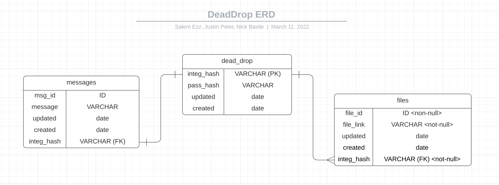
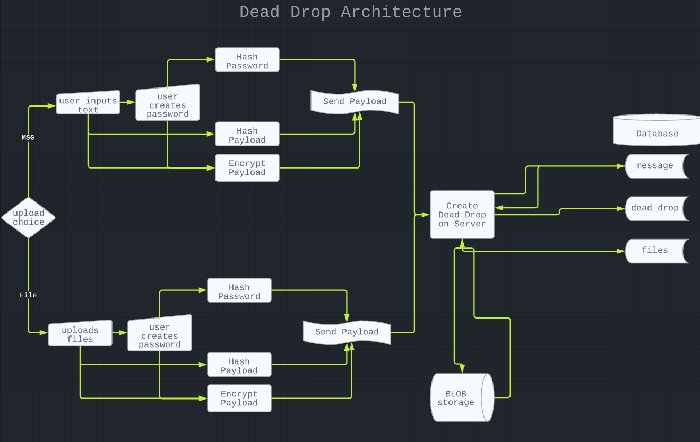

# DeadDrop.api

## data flow
| index | controller | service | repository |

| migrate | migrate(test) | Generate table creation and schema creation | connect |

## Security
 - No params. Everything is passed through headers so there is no plain text in the url.
 - Passwords are hashed and salted before storage
 - Dead drop objects are created from content hashes.
 - Messages are store with AES-256 Encryption
 - Keys feature 32 bit storage keys
 - We never use Cookies

# Design
- Dead Drop Application
  Anonymous and Secure Messanger and File Sharing

- Features

  - No command history. Message is over written on edit.
  - Compleately anonymous file sharing. No users. No email.
  - Dead Drops with unmodified passwords are deleted after a certian ammount of time.
  - (future) encrypted file storage
  - (future) store multiple files in one dead drop

- User stories

  - As a user I want to provide a hash and password and retrieve data so I can securely get the information I am looking for.

    - As a user, when I send a message I do not want to see a history so that previous conversations are left private.
    - As a user I want to enter text that attaches to a dead drop so that I can share the information with a partner.
    - As a user I want to enter text that attaches to a dead drop so that I can share the information with a partner.
    - As an Admin I want the ability to purge all data so that I can maintain database size.
    - As an Admin I want to set a time frame that data is purged from the system, so that we can maintain security and database size.
    - As a user I want to be able to change my password to ensure dead drop securityta.
    - As a user I want my hash and files assoicated to distruct after 7 days if the password is not changed so that my file are not left on a server if I forget about them.
    - As an Admin I want to conduct human checks before the user arrives to the terminal.
    - As a user I want to be able to change my password to ensure dead drop security

    - As an Admin I want the ability to purge all data so that I can maintain database size.
    - As an Admin I want to set a time frame that data is purged from the system, so that we can maintain security and database size.- ER 

- Problem Statement

  - Activitsts and Whistle Blowers require a platform which allows them to share large ammounts of data. Current market research shows there are currently no Anonymous and Encrypted file sharing methods available. DeadDrop solves this market problem by allowing users to anonymously upload encrypted files.

- UX path diagram
  

- Project Management Plan

## Base Features

- Anon Users
- Anonymous text messaging
- Encrypted File Storage
- Hash and Password Access
- Users can delete files and hashes from BLOB and DB
- If Password is not changed every 7 days, files are destroyed.
- Users can add and remove files from dead drop

## streatch

- Blob Storage
- admin page
- CLI themes

## Proposed CLI usage

application - command - option flag - payload
deaddrop -h
deaddrop upload -t <text> <text>
deaddrop upload -f <file> <file>

0-
msg

> What's your message?
> I like foo bar.

> What's your password?
> Password123

> Message saved

## Create Message

```POST: /message ```

```json
{
    "payload": "Super Secret message to share.",
    "password": "Password123"
}
```


## Recall Message

```GET: /message ```
```json
{
    "msg_id": "$2b$12$iDkCoIw//2b1Px/5tJIITeWYQAdmiwkJQd8gf8XKm4xHTzjE080z.",
    "password": "Password123"
}
```

## Update Message

```PUT: /message ```
```json
{
    "msg_id": "$2b$12$w8d/1EkpDOO0uTbGJb9T8.MWoLvKQopmINmp..auXXOWO9V/mURMC", // hash id to lookup
    "password": "Password123HelloWorld", // The currently known password
    "update": "change", // The change requested
    "option": "msg" // choose to update password 'pas' or message 'msg'
}
```

## STANDUP 20220314

- What did you do?
  - SE: rebuilt the console as Mock instead of previous library.
  - JP: Back end server
- What are you doing?
  - NB: ASCII art
  - SE: Implement conditionals for questions.
  - JP: implement encryption into controllers
  - JP: outline Endpoints
- Do you need help with anything?
  - Blinking cursor.


## Standdown 2022 03 14
- Tasks completed
 - major ui logic
 - terminals visual
 - message API

- Where do we need help?
 - implementing API with UI
 - Blob Storage


 ## Standup 2022 03 15
 - What did we do?
  - UI Logic (1/3 complete)
  - Message API complete
  - API to UI integration

- What's next?
  - UI Testing
  - API Testing
  - UI to API integration (ALL FETCH CALLS)
  
  -- Deploy
  -- File Upload

- Where do we need help
  - File uploading requires tight integration between front and back


## Stand down 2022 03 15

- What did we do?
  - Achieved MVP
- What's next
  - Power point
  - BLOB storage
  - Send to Platform
  - 


## Standup 2022 03 16
- What have you completed?
  - API Tests Complete
  - MVP
- What's next
  - Read me
  - Rebase repo
  - Blob Storage
- Where do we need help?


## Standdown 2022 03 16
- What did we complete
  - Implemented BLOB
  - Rebased Repo

- Next up 
  - Power Point
  - Read me.
 
## Possible Integrations
- Fullscreen command
- UI logic refactor
- Viewport responsiveness
- More file share encryption 
- Icons (new draft?)
- Timed message/file share distruction
- Auto HTTPS
- Animated logo
- Domain name change
- Google Marketing Platform
- Block cursor
- Human auth
- Enter password twice
